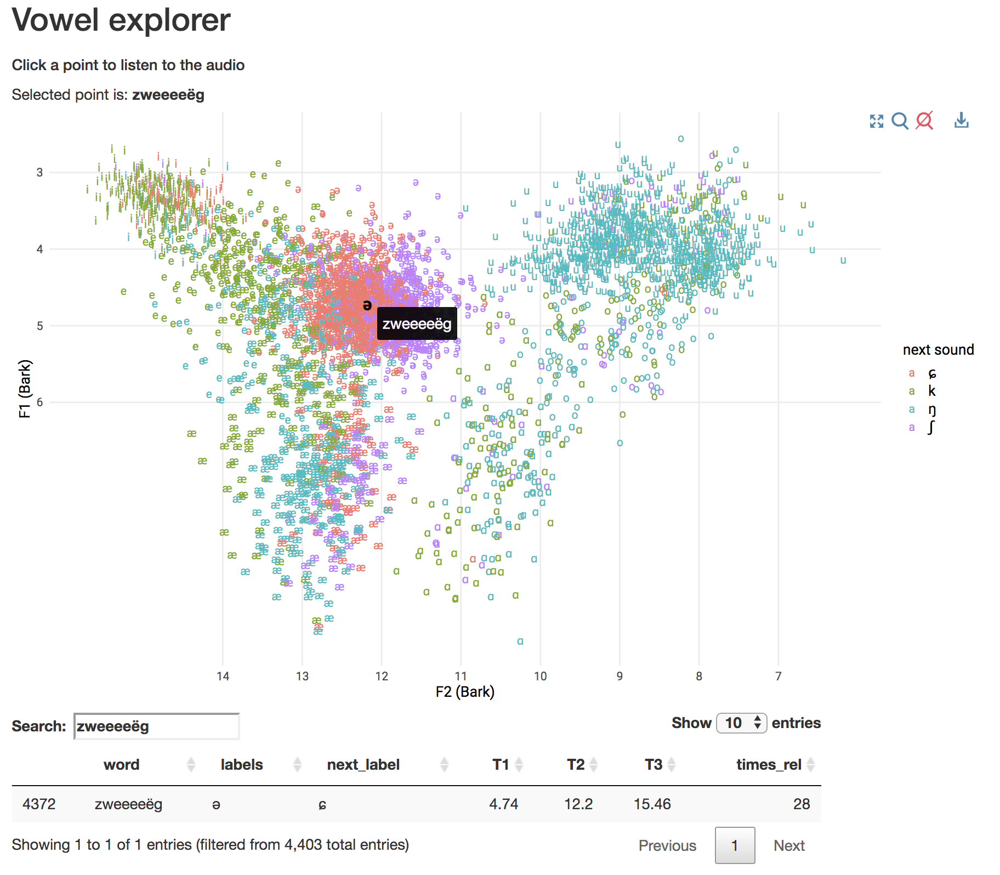

#### Vowel explorer

This app demonstrates the possibility to play audio files directly from `ggplot2` plots in shiny.

The plot shows F1/F2 measurements for 4400 vowels of Luxembourgish in four different conditions. The basic idea is to give the user the least intrusive possibility to play a sound file from the plot by simply clicking on it without opening a page or a player. Access to every vowel instance is thus immediately possible. Crowded areas can be zoomed in.

This prototype is intended to show the functionality of playing an audio from a vowel chart. It can be easily implemented in other workflows. For the example here I am using a data frame queried from an [emuR](https://github.com/IPS-LMU/emuR/) database.

The key aspect is using the `ggiraph` package which allows to include onclick events. The specific onclick event, here play audio from a public URL, is stored as an additional column `onclick` in the main data frame (coming from an `emuR` workflow in my case). `geom_text_interactive` then takes this value for the `onclick` function, similar to the `hover` function. See [here](https://davidgohel.github.io/ggiraph/articles/offcran/shiny.html) for more details, espcially the example `run_girafe_example("DT")`.

Below the plot a data table is displayed and it's content is updated according to the selection in the plot.

`Shiny` itself also offers a possibilty to include audio files using `tags$audio`, but I was not able to develop a working solution. Hints can be found [here](https://stackoverflow.com/questions/36205419/r-shiny-audio-playback/36207511#36207511).

The audio data comes from the [Luxembourgish Online Dictionary](https://github.com/spellchecker-lu/lod-audio-mirror) (CC0) and has been automatically segmented using the [MAUS tools](https://clarin.phonetik.uni-muenchen.de/BASWebServices/interface).

Working example [here](https://petergill.shinyapps.io/shinyplay/)